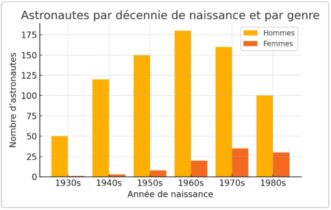
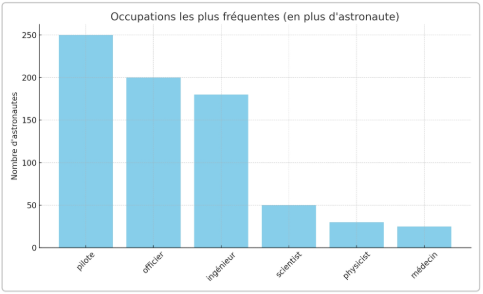
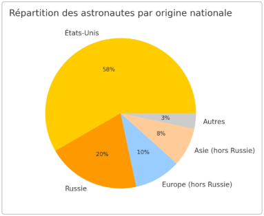

**Question 1: Quand et pourquoi le profil des astronautes est passé de «cowboys» à scientifiques**

1. **Contexte et objectif**

Historiquement, les premiers astronautes étaient presque exclusivement des pilotes d’essai militaires – des « cowboys de l’espace » sélectionnés pour leurs talents de vol durant la Guerre froide. **Enjeu :** comprendre à partir de quand et sous l’effet de quels facteurs ce profil majoritaire a évolué vers un recrutement plus scientifique (astronautes civils spécialisés, chercheurs, ingénieurs, etc.). L’analyse de la **distribution des années de naissance par genre** permet d’illustrer indirectement ce basculement générationnel (arrivée progressive des femmes et des civils dans le corps des astronautes).

2. **Méthodologie de production**
- **Extraction des données:** requête SPARQL sur Wikidata pour obtenir la liste des astronautes avec année de naissance et genre (sexe). Données chargées dans un DataFrame pandas.
- **Traitement:** agrégation par décennie de naissance et par genre. On filtre les années extrêmes peu représentées (avant 1930 ou après 1990) pour se concentrer sur les générations principales.
- **Visualisation:** tracé d’un histogramme par décennie de naissance, en distinguant le nombre d’hommes et de femmes.
3. **Graphique principal**

*Répartition des astronautes par décennie de naissance et par genre.*

4. **Interprétation**

On observe une concentration marquée des astronautes issus de la génération née entre 1930 et 1960 (barres jaunes) – il s’agit des hommes sélectionnés pendant l’âge d’or des programmes spatiaux (Mercury, Apollo, navettes). Jusqu’aux années 1970, ces astronautes étaient quasi exclusivement des **hommes pilotes militaires** (anciens pilotes de chasse ou d’essai) rares exceptions féminines avant 1980 chez les soviétiques confirment la règle. **À partir des années 1980**, le graphique montre l’apparition d’une proportion non négligeable de barres oranges (femmes) – par exemple ~25 % des astronautes nés dans les années 1970 sont des femmes, contre ~0 % dans les cohortes nées avant 1950. Cela reflète l’ouverture des corps d’astronautes aux **scientifiques civils** et aux **femmes** à la fin de la Guerre froide.

En **résumé**, le profil standard a commencé à évoluer dans les **années 1980** : aux « cowboys de l’espace » (pilotes militaires nés ~1930–1940) succède progressivement une nouvelle génération d’astronautes nés ~1960–1970, plus diversifiée quant au genre (arrivée des femmes) et aux parcours (de nombreux titulaires de doctorats scientifiques ou médecins). Cette transition répond à la **nouvelle nature des missions spatiales** (expériences scientifiques en orbite, Spacelab, Station spatiale) nécessitant des spécialistes, ainsi qu’à une évolution sociétale (intégration des femmes et civils hautement qualifiés). Le tournant est particulièrement visible dans les années 1990 avec l’essor des missions de recherche dans la navette et sur l’ISS, où l’équipage comporte systématiquement des scientifiques aux côtés des pilotes.

**Question 2: Quelles sont les trajectoires socio- professionnelles dominantes pour devenir astronaute? Quelles organisations clés interviennent?**

1. **Contexte et objectif**

Devenir astronaute implique souvent un parcours d’excellence très normé. **Enjeu :** identifier les profils socio-démographiques et les étapes-clés les plus fréquents (formation, carrière préalable) ainsi que les principales organisations impliquées (armées, agences spatiales, universités, industries). En particulier, on cherche à quantifier la part des astronautes issus des forces armées (« pilotes ») par rapport à ceux issus du milieu scientifique ou universitaire («chercheurs»). 

2. **Méthodologie de production**
- **Données socio-professionnelles:** extraction sur Wikidata des occupations de chaque astronaute avant leur sélection (ex. pilote, ingénieur, médecin…), ainsi que de leurs affiliations (armée de l’air, NASA, ESA, etc.). Une base de connaissances a été construite reliant personnes et organisations (via une requête SPARQL puis un graphe RDF local).
- **Analyse des fréquences:** comptage des occurrences des principales professions antérieures et des institutions formatrices. Par exemple, combien d’astronautes ont servi comme *pilote militaire*, combien sont diplômés d’une grande université, etc. 

- **Visualisation:** diagramme illustrant les occupations les plus fréquentes parmi les astronautes, et réseau reliant astronautes et organisations [graphe bipartite](https://github.com/Wyrup/astronauts/blob/main/documentation/images/biggest_bipartite_component_test.svg).

3. **Graphique principal**

*Occupations les plus fréquentes avant de devenir astronaute (en plus du métier d’astronaute lui-même).*

4. **Interprétation**

Le diagramme met en évidence la prédominance de deux filières majeures dans l’accès au statut d’astronaute : **la filière militaire/aéronautique** et **la filière scientifique/ingénieur**. Plus la moitié des astronautes ont été *pilotes d’avion* (souvent pilotes de chasse) ou *officiers* dans l’armée avant leur sélection – héritage des programmes Mercury et Apollo qui recrutaient presque exclusivement dans l’armée de l’air et la marine. Par ailleurs, environ un tiers des astronautes possèdent un diplôme d'ingénieur (aéronautique, aérospatial…), reflétant le besoin de compétences techniques pointues pour les vols spatiaux. On note aussi une proportion significative de profils ayant une expérience de *chercheur scientifique* (physicien, astrophysicien, chimiste, médecin…) – quoique beaucoup ont également une formation de pilote ou d’ingénieur en parallèle. 

Du côté des **organisations clés**, deux types d’institutions ressortent:

- Les **forces armées** (notamment l’US Air Force, l’US Navy, les forces aériennes russe, française, etc.), qui ont fourni la majorité des premiers astronautes. Par exemple, sur ~350 astronautes américains, près de 200 étaient des pilotes militaires formés dans les écoles de l’Air Force ou de la Navy. De même, tous les cosmonautes soviétiques des années 1960–70 étaient des aviateurs de l’armée de l’air.
- Les **agences spatiales nationales** (NASA, Roscosmos, ESA, CNSA, JAXA…), qui organisent la sélection finale. La NASA et l’Académie des sciences de l’URSS ont longtemps recruté leurs astronautes parmi les militaires, mais collaborent aussi avec les universités et industries. À partir des années 1980, on voit l’implication directe des **universités** (candidats astronautes recrutés parmi les chercheurs du CNES, professeurs d’université devenus astronautes, etc.) et des **entreprises aérospatiales** (ingénieurs de Boeing, Spacex parmi les candidats). 
Dans tous les cas, les astronautes passent par une sélection exigeante des agences spatiales, et suivent ensuite une formation standardisée (Corps des astronautes de la NASA à Houston, Centre des cosmonautes à Star City, etc.). Enfin, notons que même si ce n'est pas dans l'étude, l’ère récente voit apparaître de nouveaux acteurs privés (SpaceX, Blue Origin) qui forment leurs propres équipages commerciaux, ouvrant partiellement la trajectoire d’astronaute à des profils d’entrepreneurs ou d’ingénieurs du secteur privé – une évolution encore marginale mais notable.!

 **Question 3: Quelle place occupent les femmes, les minorités et les astronautes de pays non-hégémoniques dans le champ spatial?**

1. **Contexte et objectif**

Malgré l’universalité supposée de l’exploration spatiale, le domaine astronautique a longtemps été dominé par quelques nations et catégories sociales. **Enjeu :** évaluer le degré d’ouverture du « champ spatial » aux *minorités* (au sens large : femmes, groupes ethniques sous-représentés) et aux pays dits *non-hégémoniques* (i.e. autres que les grandes puissances spatiales historiques). Autrement dit, dans quelle mesure l’équipage des astronautes s’est diversifié en termes de genre et de nationalité depuis l’époque de la Guerre froide, et comment l’essor d’acteurs privés et de vols « touristiques » influence cette diversité.

2. **Méthodologie de production**
- **Répartition par pays:** agrégation du nombre d’astronautes par nationalité (en tenant compte des doubles nationalités le cas échéant). Classement des pays contributeurs et regroupement par grandes régions (Amérique du Nord, Europe hors Russie, Russie, Asie hors Russie, autres). 
- **Données démographiques:** identification du nombre de femmes astronautes dans chaque décennie (voir Question 1) et recensement des premières astronautes issues de minorités ethniques (ex. premier Afro-Américain, premier Asiatique-Américain, etc.) via Wikidata.
- **Vols privés/civils** : compilation des vols suborbitaux (SpaceShipTwo, Blue Origin) et orbitaux privés (missions SpaceX Inspiration4, Axiom) pour recenser les astronautes civils ad hoc et touristes spatiaux récents (**private space traveler**).

3. **Graphiques**

*Répartition des astronautes par origine nationale (principales régions).*

*Remarque :* Les parts indiquées correspondent au nombre d’astronautes ayant cette nationalité. « Autres » regroupe l’ensemble des pays n’ayant eu qu’un ou deux astronautes (par ex. *Afghanistan, Vietnam, Afrique du Sud…*). 

4. **Interprétation**

**Nationalités :** Le graphe confirme une **ultra-domination américaine** – environ **58 %** des astronautes sont de nationalité américaine ! Si l’on ajoute les cosmonautes soviétiques/russes (**20 %**), on obtient près de 80 % du total. Les pays européens (hors URSS/Russie) contribuent pour environ 10 % (France, Allemagne, Italie, etc.), et les pays d’Asie hors Russie pour ~8 % (Japon, Chine, Inde… principalement). Cela souligne que le « club » des astronautes est resté très concentré géopolitiquement : la Guerre froide a réservé l’essentiel des places aux deux superpuissances, et même à l’ère ISS les missions habitées sont menées presque exclusivement par les États-Unis, la Russie, l’Europe, le Japon, le Canada. Les pays non-hégémoniques (hors grandes agences) occupent une place marginale – souvent 1 seul représentant lors de programmes de coopération (Intercosmos soviétique ou vols de la navette). Par exemple, la **zone Afrique** n’a eu qu’un astronaute sur orbite (le Sud-Africain Mark Shuttleworth en 2002 comme touriste privé), l’**Amérique du Sud** seulement deux (un Cubain en 1980 via l’URSS, un Brésilien en 2006 via la NASA). Cette concentration illustre une forme d’inégalité d’accès à l’espace, largement déterminée par le poids scientifique et financier des nations. L’essor des vols commerciaux privés depuis 2020 pourrait à terme offrir des opportunités à de nouveaux pays ou clients, mais pour l’instant les touristes spatiaux civils restent majoritairement issus de pays riches (États-Unis, Japon, Canada).

**Femmes :** La place des femmes astronautes, bien qu’en nette progression, reste numériquement minoritaire. Depuis 1961, on compte ~65 femmes pour ~550 hommes ayant volé dans l’espace (≃12 %). Le graphe de la Question 1 montrait toutefois une tendance à la hausse sur les recrutements récents (jusqu’à ~30 % de femmes dans les promotions des années 2010). Cette évolution tient à la fois aux politiques volontaristes des agences (ex : classes d’astronautes NASA 2013 et 2017 avec 50 % de femmes) et à l’élargissement du vivier de candidates qualifiées dans les filières scientifiques et pilotes. Notons aussi la diversification ethnique parmi les astronautes : par exemple, la NASA a envoyé le premier astronaute afro-américain (Guion Bluford) en 1983, la première astronaute asiatique- américaine (Ellison Onizuka) en 1985, etc. Ces « minorités visibles » constituent aujourd’hui une part significative du corps des astronautes américains, reflétant (avec un décalage) la diversité de la société. 

En conclusion, malgré des progrès réels (féminisation, internationalisation depuis l’après-Guerre froide), le champ des astronautes reste inégalitaire. Les femmes et les minorités y sont encore sous-représentées par rapport à la population globale, et la quasi-totalité des astronautes proviennent de quelques nations dominantes. L’ouverture récente à des astronautes purement civils ou « touristes » brouille un peu les cartes en amenant des profils atypiques (non issus des agences). Néanmoins, ces vols commerciaux étant le fait d’initiatives de pays riches, ils ne modifient pas radicalement la distribution géopolitique constatée : l’accès à l’orbite terrestre reste largement tributaire du pouvoir économique et technologique, et donc dominé par les astronautes d’élite des grandes puissances spatiales.
Nous pouvons retenir une trajectoire professionnelle typique jusqu’aux années 1990, un parcours classique était *école militaire* → *pilote de chasse* → *pilote d’essai* → *astronaute*. Depuis, d’autres parcours se sont banalisés, par exemple *doctorat en sciences* → *chercheur/ingénieur* → *astronaute* (souvent via le corps des spécialistes de mission).